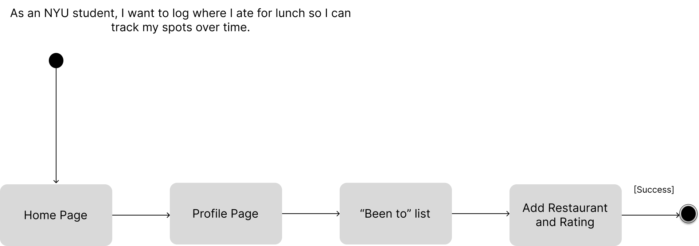
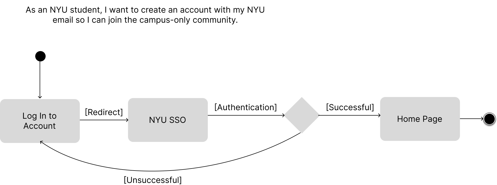

# Specification Phase Exercise

A little exercise to get started with the specification phase of the software development lifecycle. See the [instructions](instructions.md) for more detail.

## Team members

See instructions. Delete this line and replace with a list of the names of your team members, including links to each one's GitHub profile.

## Stakeholders

See instructions. Delete this line and replace with the name(s) of the stakeholder(s) you interviewed and lists showing their goals/needs, and problems/frustrations.

## Product Vision Statement

See instructions. Delete this line and place your Product Vision Statement here.

## User Requirements

See instructions. Delete this line and place a list of your User Stories here.

## Activity Diagrams

### User Story 1

"As an NYU student, I want to log where I ate for lunch so I can track my spots over time."

### User Story 2

"As an NYU student, I want to create an account with my NYU email so I can join the campus-only community."

## Clickable Prototype

See instructions. Delete this line and place a publicly-accessible link to your clickable prototype here.
