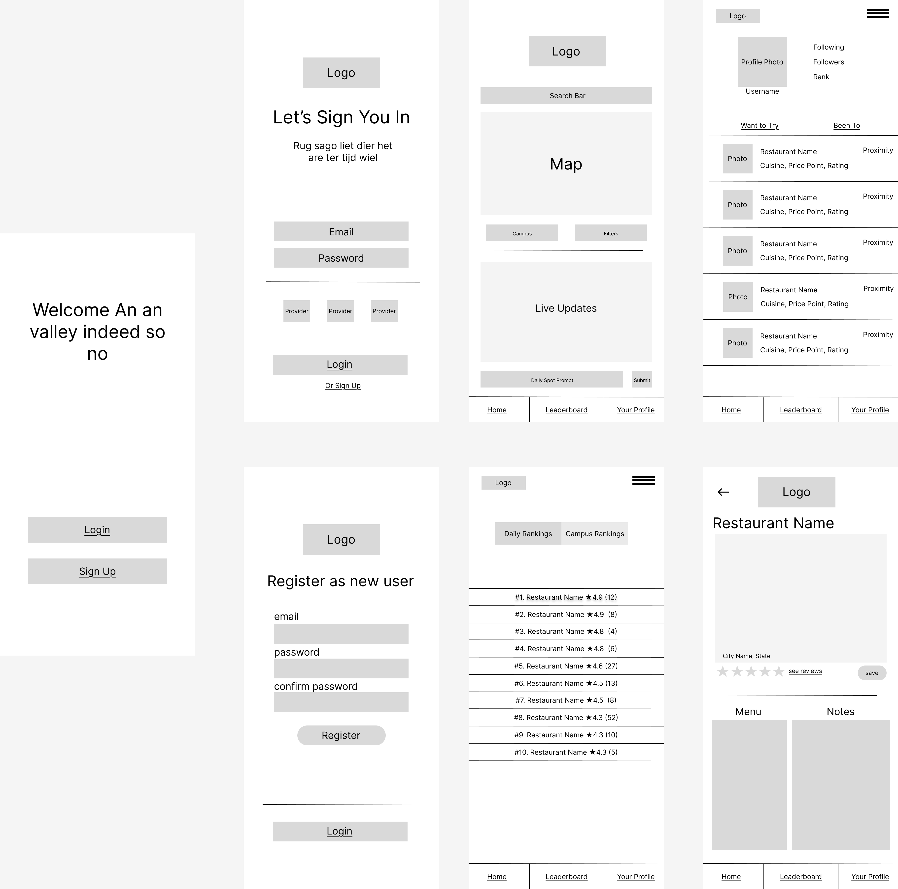

# Specification Phase Exercise

A little exercise to get started with the specification phase of the software development lifecycle. See the [instructions](instructions.md) for more detail.

## Team members

Alex Xie, Phoebe Huang, Xiaomin Liu, Jacob Ng

## Ideation
Our project is a food discovery app designed exclusively for the NYU community. The goal is to make it easier for students to decide where to eat around campus by combining personal tracking with community insights.
On the individual side, each student can input where they ate for lunch, give a corresponding rating, and see their personal list automatically sorted by their preferences. This helps students keep track of favorites, compare experiences, and explore new options over time.

On the community side, the app prompts students once a day to share where they ate. These responses feed into a live tracker that generates daily rankings of the most popular lunch spots among NYU students. Beyond the daily trackers, the app also maintains an overall ranking of all NYU food spots that students have added and rated.

Unlike broader food apps like Yelp, our focus is specifically on NYU lunch culture, highlighting dining halls and affordable food spots near campus rather than high-end restaurants. The result is a tool that blends personal recommendations with community-driven rankings, while also showcasing discounted places available for NYU students, making it easier (and more fun) for students to decide what’s for lunch. 

Gone are the days of spending 15 minutes with friends trying to decide what’s for lunch.

## Stakeholders

See instructions. Delete this line and replace with the name(s) of the stakeholder(s) you interviewed and lists showing their goals/needs, and problems/frustrations.

## Product Vision Statement

Eats@NYU is a community-driven food discovery app that helps NYU students quickly decide where to eat by combining personal tracking with daily campus-wide lunch trends and rankings.

## User Requirements

As an NYU student, I want to create an account with my NYU email so I can join the campus-only community.

As an NYU student, I want to log where I ate for lunch so I can track my spots over time.

As an NYU student, I want to rate today’s lunch so I can remember what I liked.

As an NYU student, I want to add a short note/photo to a lunch entry so I can recall details later.

As an NYU student, I want to edit or delete a past lunch entry so I can fix mistakes.

As an NYU student, I want to set my dietary and cuisine preferences so I can get a personalized lunch list

As an NYU student, I want to be able to filter my personal list by my preferences so I can find an option fast.

As an NYU student, I want to discover spots other students eat at so I can expand my options.

As an NYU student, I want to search and filter by cuisine, budget, distance, dine-in, and dietary tags so I can narrow choices for today.

As an NYU student, I want to see the most up-to-date menu and specials (from restaurants or crowdsourced updates) so I can choose with confidence.

As an NYU student, I want to get an optional daily prompt to share where I ate so I can contribute to the community daily ranking.

As an NYU student, I want to see today’s live ranking of most popular lunch spots so I can follow campus lunch trends.

As an NYU student, I want to see an overall all-time leaderboard so I can find the campus staples.

As an NYU student, I want to see trending indicators based on changes in daily popularity so I can catch rising or fading spots.

As an NYU student, I want to see public reviews by other students so I can get more context of the restaurant.

As an NYU student, I want to suggest a new lunch spot if it’s missing so the directory stays current.

As an NYU student, I want to suggest merging duplicate spots so I can reduce clutter in rankings.

As an NYU student, I want to report inappropriate content so I can keep the community helpful.

As an NYU student, I want to see average price and typical wait time (crowd-sourced) so I can plan within my budget and schedule.

As an admin, I want to verify NYU email domains so I can keep access restricted to the community.

As an admin, I want to moderate reports and remove content so I can enforce community guidelines.
As an admin, I want to merge/rename spots and manage categories so I can maintain clean rankings.

## Activity Diagrams

### User Story 1

"As an NYU student, I want to log where I ate for lunch so I can track my spots over time."

### User Story 2

"As an NYU student, I want to create an account with my NYU email so I can join the campus-only community."

## Wireframe

## Clickable Prototype

https://www.figma.com/proto/tJ4l0GGmRdSyLxzWis5bhX/Penguin?node-id=6-3&t=czR8NcqssgHpUiec-1&starting-point-node-id=6%3A3